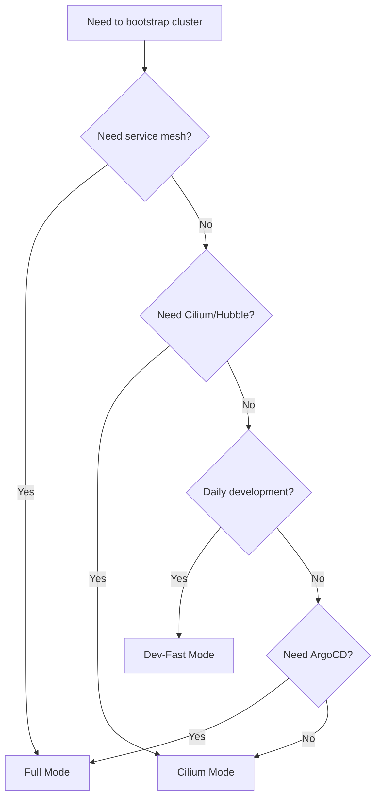

## Quick Comparison

<CardGroup cols={3}>
  <Card title="Dev-Fast" icon="bolt" href="/bootstrap/dev-fast">
    **~120s** - Daily development
  </Card>
  <Card title="Cilium" icon="network-wired" href="/bootstrap/cilium-mode">
    **~200s** - CNI testing
  </Card>
  <Card title="Full" icon="rocket" href="/bootstrap/full-mode">
    **~250s** - Full-stack validation
  </Card>
</CardGroup>

## Feature Matrix

| Feature | Dev-Fast | Cilium | Full |
|---------|----------|--------|------|
| **CNI** | kindnetd | Cilium + Hubble | Cilium + Hubble |
| **Nodes** | control-plane × 1 | control-plane + worker × 1 | control-plane + worker × 2 |
| **Istio** | ❌ None | ❌ None | ✅ Ambient mode |
| **ArgoCD** | ❌ None | ❌ None | ✅ GitOps |
| **Warm Cluster** | ✅ Hash-based | ❌ Not supported | ✅ Hash-based |
| **Cold Start** | ~120s | ~200s | ~250s |
| **Warm Start** | Instant / 10-15s | N/A | Instant / reapply |
| **Command** | `bootstrap` | `bootstrap --full` | `full-bootstrap` |

## Timing Breakdown

### Dev-Fast Mode (~120s)

<AccordionGroup>
  <Accordion title="Phase Timing (Apple M4, 24GB RAM)">
    | Phase | Duration | Description |
    |-------|----------|-------------|
    | phase1-prep | ~12s | kind + manifests + OTel + images (parallel) |
    | phase2-load | ~37s | Load images into kind |
    | phase3-deploy | ~21s | Deploy services (parallel) |
    | phase4-wait | ~52s | Wait for pods |
    | **TOTAL** | **~122s** | **38% faster than Cilium** |
  </Accordion>
</AccordionGroup>

### Cilium Mode (~200s)

<Info>
Adds Cilium installation overhead but provides network observability.
</Info>

### Full Mode (~250s)

<Info>
Adds Istio + ArgoCD + second worker node. Most complete but slowest.
</Info>

## Warm Start Comparison

<Tabs>
  <Tab title="Dev-Fast">
    ### Hash-Based Caching
    
    **Storage:** `.bootstrap-state/`
    
    **Scenarios:**
    - ✅ **Instant** - No changes (hash match)
    - ⚡ **10-15s** - Manifest changes only
    - 🔄 **~120s** - Cluster config changes
    
    **Usage:**
    ```bash
    bootstrap           # Smart detection
    bootstrap --clean   # Force rebuild
    ```
  </Tab>
  <Tab title="Cilium">
    ### No Warm Support
    
    **Always performs full bootstrap (~200s)**
    
    No hash caching or state detection.
  </Tab>
  <Tab title="Full">
    ### Hash-Based Caching
    
    **Storage:** `.bootstrap-state-full/`
    
    **Scenarios:**
    - ✅ **Instant** - No changes (hash match)
    - ⚡ **Fast** - Manifest changes only
    - 🔄 **~250s** - Cluster config changes
    
    **Usage:**
    ```bash
    full-bootstrap           # Smart detection
    full-bootstrap --clean   # Force rebuild
    ```
  </Tab>
</Tabs>

## Network Stack

<CardGroup cols={3}>
  <Card title="Dev-Fast" icon="network-wired">
    ### kindnetd
    - Default CNI
    - No overhead
    - Basic networking
    - **Fastest startup**
  </Card>
  <Card title="Cilium" icon="shield">
    ### Cilium + Hubble
    - eBPF-based CNI
    - Network policies
    - Traffic observability
    - **Hubble UI included**
  </Card>
  <Card title="Full" icon="mesh">
    ### Cilium + Istio
    - Cilium CNI
    - Istio ambient mode
    - mTLS encryption
    - **Service mesh**
  </Card>
</CardGroup>

## Use Case Guide

### When to Use Dev-Fast

<AccordionGroup>
  <Accordion title="Daily Development" icon="code">
    - Rapid iteration cycles
    - Frequent restarts
    - Application development
    - Local testing
  </Accordion>
  <Accordion title="Resource Constraints" icon="memory">
    - Limited RAM/CPU
    - Single control-plane
    - Minimal overhead
    - Laptop development
  </Accordion>
  <Accordion title="Quick Testing" icon="flask">
    - Fast feedback loops
    - CI/CD pipelines
    - Unit/integration tests
    - Demo environments
  </Accordion>
</AccordionGroup>

### When to Use Cilium

<AccordionGroup>
  <Accordion title="CNI Testing" icon="network-wired">
    - Network policy validation
    - eBPF feature testing
    - CNI performance testing
    - Cilium-specific features
  </Accordion>
  <Accordion title="Network Debugging" icon="bug">
    - Traffic flow analysis
    - Service dependency mapping
    - Network bottlenecks
    - Policy troubleshooting
  </Accordion>
  <Accordion title="Middle Ground" icon="balance-scale">
    - More realistic than dev-fast
    - Faster than full
    - No service mesh complexity
    - Network observability needed
  </Accordion>
</AccordionGroup>

### When to Use Full

<AccordionGroup>
  <Accordion title="Full-Stack Validation" icon="check-double">
    - Production parity testing
    - Integration testing
    - End-to-end validation
    - Release candidates
  </Accordion>
  <Accordion title="Service Mesh Testing" icon="mesh">
    - Istio policy validation
    - mTLS testing
    - Traffic management
    - Security features
  </Accordion>
  <Accordion title="GitOps Workflows" icon="git">
    - ArgoCD deployment testing
    - Multi-environment sync
    - Rollback scenarios
    - CD pipeline validation
  </Accordion>
  <Accordion title="Multi-Node Testing" icon="server">
    - Distributed workloads
    - Node affinity/anti-affinity
    - Pod spreading
    - HA validation
  </Accordion>
</AccordionGroup>

## Command Reference

### Dev-Fast

```bash
# Standard bootstrap (warm aware)
bootstrap

# Force clean rebuild
bootstrap --clean

# Switch to Cilium mode
bootstrap --full
```

### Cilium

```bash
# Via bootstrap flag (recommended)
bootstrap --full

# Direct invocation
bootstrap-full
```

### Full

```bash
# Standard bootstrap (warm aware)
full-bootstrap

# Force clean rebuild
full-bootstrap --clean
```

## Exposed Services Comparison

| Service | Dev-Fast | Cilium | Full |
|---------|----------|--------|------|
| **ArgoCD** | ❌ | ❌ | ✅ :30080 |
| **Grafana** | ✅ :30300 | ✅ :30300 | ✅ :30300 |
| **Prometheus** | ✅ :30090 | ✅ :30090 | ✅ :30090 |
| **Alertmanager** | ✅ :30093 | ✅ :30093 | ✅ :30093 |
| **Hubble UI** | ❌ | ✅ :31235 | ✅ :31235 |
| **Traefik** | ✅ :30081 | ✅ :30081 | ✅ :30081 |

## Resource Usage

<CardGroup cols={3}>
  <Card title="Dev-Fast" icon="leaf">
    ### Minimal
    - 1 node
    - kindnetd CNI
    - No service mesh
    - **~4-6GB RAM**
  </Card>
  <Card title="Cilium" icon="gauge">
    ### Moderate
    - 2 nodes
    - Cilium + Hubble
    - No service mesh
    - **~6-8GB RAM**
  </Card>
  <Card title="Full" icon="rocket">
    ### High
    - 3 nodes
    - Cilium + Istio
    - ArgoCD
    - **~8-12GB RAM**
  </Card>
</CardGroup>

## Decision Tree



## Migration Between Modes

You can switch between modes by destroying and recreating:

```bash
# From dev-fast to Cilium
cluster-down
bootstrap --full

# From dev-fast to full
cluster-down
full-bootstrap

# From Cilium to dev-fast
cluster-down
bootstrap

# From full to dev-fast
cluster-down
bootstrap
```

<Warning>
Switching modes destroys the existing cluster. Ensure you've saved any important data.
</Warning>

## Performance Tips

<AccordionGroup>
  <Accordion title="Dev-Fast Optimization">
    - Use warm cluster support (don't use `--clean` unless necessary)
    - R2 OTel cache enabled via `devenv.nix`
    - Keep cluster running with `cluster-stop` instead of `cluster-down`
  </Accordion>
  <Accordion title="Cilium Optimization">
    - Pre-pull images before bootstrap
    - Use SSD for Docker storage
    - Increase Docker resource limits
  </Accordion>
  <Accordion title="Full Optimization">
    - Use warm cluster support
    - Pre-generate manifests
    - Keep cluster running between tests
    - Use `--clean` only when needed
  </Accordion>
</AccordionGroup>

## Common Operations

### Cluster Management

| Command | Effect | When to Use |
|---------|--------|-------------|
| `cluster-stop` | Pause containers (state preserved) | Before reboot, save resources |
| `cluster-start` | Resume containers | Continue work |
| `cluster-down` | Delete cluster completely | Reset environment |

### Benchmarking

```bash
# Run bootstrap 3 times and show statistics
benchmark 3
```

Results saved to `logs/benchmark/` with phase timing and resource usage.

## Next Steps

<CardGroup cols={3}>
  <Card title="Dev-Fast Guide" icon="bolt" href="/bootstrap/dev-fast">
    Learn about dev-fast mode
  </Card>
  <Card title="Cilium Guide" icon="network-wired" href="/bootstrap/cilium-mode">
    Explore Cilium mode
  </Card>
  <Card title="Full Guide" icon="rocket" href="/bootstrap/full-mode">
    Discover full mode
  </Card>
</CardGroup>