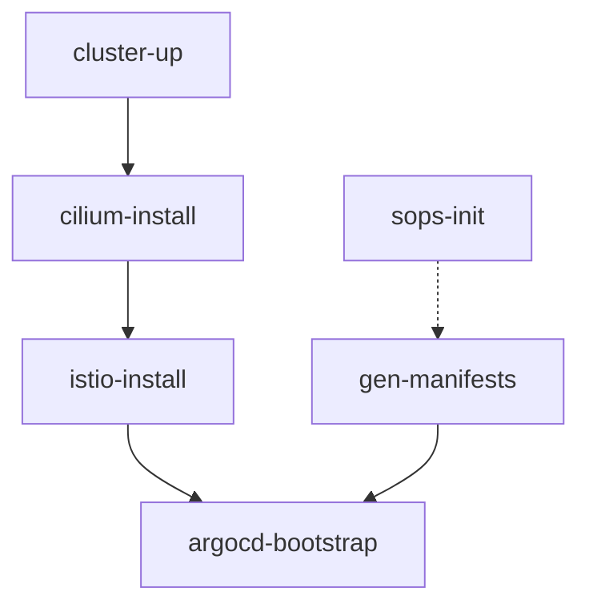

Utility commands provide specialized functionality for infrastructure setup, security, and maintenance.

## sops-init

Generate age encryption key for SOPS secret management.

### Syntax

```bash
sops-init
```

### Behavior

1. Checks if age key already exists at `~/.config/sops/age/keys.txt`
2. If exists: Displays public key
3. If not exists:
   - Creates directory `~/.config/sops/age/`
   - Generates new age key pair
   - Saves private key to `keys.txt`
   - Displays public key

### Example

```bash
# Generate new key
sops-init
```

### Output

```bash
# New key generated
Public key: age1abc123def456...

Key generated at /Users/username/.config/sops/age/keys.txt
Add the public key above to .sops.yaml

# Key already exists
Age key already exists at /Users/username/.config/sops/age/keys.txt
Public key:
age1abc123def456...
```

### Next Steps

After generating the key:

1. **Add public key to `.sops.yaml`:**

```yaml
creation_rules:
  - path_regex: secrets/.*\.yaml$
    age: age1abc123def456...
```

2. **Encrypt secrets:**

```bash
sops encrypt secrets/database.yaml > secrets/database.enc.yaml
```

3. **Decrypt secrets:**

```bash
sops decrypt secrets/database.enc.yaml
```

### Use Cases

- Initial secrets infrastructure setup
- Rotate encryption keys
- Team member onboarding
- CI/CD secret encryption

### Related Tools

- `sops` - Secret encryption/decryption
- `age` - Modern encryption tool
- `.sops.yaml` - SOPS configuration file

---

## cloudflared-setup

Set up Cloudflare Tunnel for secure external access.

### Syntax

```bash
cloudflared-setup
```

### Behavior

Automated setup of Cloudflare Tunnel:

1. **Login**: Authenticates with Cloudflare (opens browser)
2. **Create Tunnel**: Creates tunnel named `microservice-infra`
3. **Get Credentials**: Extracts tunnel ID and credentials file
4. **Create Secret**: Injects credentials into Kubernetes as Secret
5. **Create DNS**: Creates CNAME records for configured domains
6. **Instructions**: Displays Cloudflare Access setup steps

### Example

```bash
# Setup Cloudflare Tunnel
cloudflared-setup
```

### Output

```
=== Cloudflare Tunnel Setup ===

--- Step 1: Logging in to Cloudflare ---
Already logged in (cert.pem exists). Skipping.

--- Step 2: Creating tunnel 'microservice-infra' ---
Tunnel 'microservice-infra' already exists. Skipping creation.

Tunnel ID: abc123-def456-ghi789

--- Step 3: Creating Kubernetes Secret ---
Secret 'tunnel-credentials' created in namespace 'cloudflare'.

--- Step 4: Creating DNS records ---
  Creating CNAME for grafana.thirdlf03.com → abc123-def456-ghi789.cfargotunnel.com
  Creating CNAME for hubble.thirdlf03.com → abc123-def456-ghi789.cfargotunnel.com
  Creating CNAME for argocd.thirdlf03.com → abc123-def456-ghi789.cfargotunnel.com

=== Setup Complete ===
```

### Configured Domains

The script creates DNS records for:

- `grafana.thirdlf03.com` - Grafana observability UI
- `hubble.thirdlf03.com` - Hubble network observability
- `argocd.thirdlf03.com` - ArgoCD GitOps UI

### Cloudflare Access Setup

After running the command, configure Zero Trust Access:

1. **Go to**: https://one.dash.cloudflare.com/

2. **Add Identity Provider**:
   - Navigate to: Zero Trust → Integrations → Identity providers
   - Add new → GitHub
   - Configure GitHub OAuth App credentials

3. **Create Access Applications**:
   - Navigate to: Zero Trust → Access → Applications
   - Create application for each subdomain
   - Configure authentication policies

4. **Add Policy**:
   - Action: Allow
   - Include: GitHub Organization = `<your-org>`

### Apply Manifests

After setup, deploy Cloudflared:

```bash
# Regenerate manifests (includes tunnel credentials)
gen-manifests

# Apply cloudflared manifests
kubectl apply -f manifests/cloudflared/
```

### Use Cases

- Expose local cluster to internet
- Share development environment
- Demo applications to clients
- Test external integrations
- Secure remote access

### Related Commands

- [bootstrap](/cli/bootstrap#bootstrap) - Automatically applies cloudflared if configured
- [gen-manifests](/cli/manifests#gen-manifests) - Regenerate with tunnel credentials

---

## istio-install

Install Istio service mesh in ambient mode.

### Syntax

```bash
istio-install
```

### Behavior

1. **Gateway API CRDs**: Installs Kubernetes Gateway API v1.5.0
2. **Istio Installation**: Installs Istio with ambient profile
3. **Tracing Configuration**: Enables OpenTelemetry tracing
4. **Namespace Setup**: Creates and labels `microservices` namespace
5. **Waypoint Proxy**: Deploys waypoint proxy for L7 processing
6. **Custom Resources**: Applies Istio CRs from `istio/` directory

### Example

```bash
# Install Istio
istio-install
```

### Output

```
=== Installing Gateway API CRDs ===
customresourcedefinition.apiextensions.k8s.io/gatewayclasses.gateway.networking.k8s.io created
customresourcedefinition.apiextensions.k8s.io/gateways.gateway.networking.k8s.io created

=== Installing Istio (ambient profile) ===
✔ Istio core installed
✔ Istiod installed
✔ CNI installed
✔ Ztunnel installed
✔ Installation complete

=== Ensuring microservices namespace ===
namespace/microservices created

=== Labeling namespace for ambient mode ===
namespace/microservices labeled

=== Deploying waypoint proxy ===
gateway.gateway.networking.k8s.io/microservices created

=== Istio ambient setup complete ===
```

### Configuration

Istio is installed with:

```yaml
profile: ambient
meshConfig:
  enableTracing: true
  extensionProviders:
    - name: otel-tracing
      opentelemetry:
        service: otel-collector.observability.svc.cluster.local
        port: 4317
```

### Ambient Mode Features

- **L4 Processing**: ztunnel for transparent TCP/UDP proxying
- **L7 Processing**: Waypoint proxy for HTTP/gRPC features
- **No Sidecars**: Reduced resource overhead
- **Namespace-Scoped**: Label namespaces for ambient mode

### Namespace Configuration

The `microservices` namespace is labeled:

```yaml
istio.io/dataplane-mode: ambient
```

### Use Cases

- Service mesh for microservices
- Mutual TLS between services
- Traffic management (retries, timeouts)
- Distributed tracing
- Circuit breaking
- Canary deployments

### Related Commands

- [bootstrap-full](/cli/bootstrap#bootstrap-full) - Includes Istio installation
- [cilium-install](#cilium-install) - Install before Istio for CNI

---

## cilium-install

Install Cilium CNI with Hubble observability.

### Syntax

```bash
cilium-install
```

### Behavior

1. **Helm Installation**: Installs Cilium via OCI chart
2. **Image Pull**: Uses `IfNotPresent` policy (assumes image pre-loaded)
3. **CNI Configuration**: Configures for Istio coexistence
4. **Hubble Setup**: Enables Hubble Relay and UI
5. **NodePort**: Exposes Hubble UI on port 31235
6. **Readiness Wait**: Waits for Cilium DaemonSet rollout

### Example

```bash
# Install Cilium
cilium-install
```

### Output

```
=== Installing Cilium (with Hubble) via OCI chart ===
Release "cilium" does not exist. Installing it now.

NAME: cilium
LAST DEPLOYED: Mon Dec 12 10:30:45 2024
NAMESPACE: kube-system
STATUS: deployed
REVISION: 1

=== Waiting for Cilium DaemonSet to be ready ===
daemon set "cilium" successfully rolled out

=== Cilium installation complete ===
```

### Configuration

Cilium is installed with:

```yaml
image.pullPolicy: IfNotPresent
ipam.mode: kubernetes
cni.exclusive: false              # Chain with Istio CNI
socketLB.hostNamespaceOnly: true  # Avoid Istio conflicts
kubeProxyReplacement: false       # Safe Istio coexistence
hubble.enabled: true
hubble.relay.enabled: true
hubble.ui.enabled: true
hubble.ui.service.type: NodePort
hubble.ui.service.nodePort: 31235
```

### Istio Coexistence

Key settings for Istio compatibility:

- `cni.exclusive=false`: Allows CNI plugin chaining
- `socketLB.hostNamespaceOnly=true`: Prevents traffic redirection conflicts
- `kubeProxyReplacement=false`: Safer mode for service mesh

### Hubble Access

After installation:

```bash
# Access Hubble UI
open http://localhost:31235

# Check Cilium status
cilium status

# Observe network flows
hubble observe -n microservices
```

### Use Cases

- eBPF-based networking
- Network policy enforcement
- Network observability
- Service load balancing
- Kubernetes CNI replacement

### Related Commands

- [bootstrap-full](/cli/bootstrap#bootstrap-full) - Includes Cilium installation
- [istio-install](#istio-install) - Install after Cilium
- [Hubble commands](/cli/monitoring#hubble-cli-commands) - Network observability

---

## argocd-bootstrap

Bootstrap ArgoCD for GitOps continuous delivery.

### Syntax

```bash
argocd-bootstrap
```

### Behavior

1. **Build Manifests**: Generates nixidy manifests
2. **Create Namespace**: Creates `argocd` namespace
3. **Apply Manifests**: Server-side apply with conflict resolution
4. **Wait for Ready**: Waits for ArgoCD server deployment
5. **Display Credentials**: Shows initial admin password

### Example

```bash
# Bootstrap ArgoCD
argocd-bootstrap
```

### Output

```
Building nixidy manifests...
Creating argocd namespace...
namespace/argocd created

Applying ArgoCD manifests to cluster (server-side apply)...
customresourcedefinition.apiextensions.k8s.io/applications.argoproj.io created
customresourcedefinition.apiextensions.k8s.io/applicationsets.argoproj.io created
service/argocd-server created
deployment.apps/argocd-server created
...

Waiting for ArgoCD server to be ready...
deployment.apps/argocd-server condition met

ArgoCD initial admin password:
abc123DEF456xyz789

ArgoCD UI: http://localhost:30080
Login with username 'admin' and the password above.
```

### Access ArgoCD

```bash
# Open UI
open http://localhost:30080

# Login credentials
Username: admin
Password: <from output above>
```

### ArgoCD CLI

```bash
# Login via CLI
argocd login localhost:30080

# List applications
argocd app list

# Sync application
argocd app sync <app-name>
```

### Use Cases

- GitOps continuous delivery
- Declarative application management
- Multi-environment deployments
- Automated sync from Git
- Application health monitoring

### Related Commands

- [bootstrap-full](/cli/bootstrap#bootstrap-full) - Includes ArgoCD
- [gen-manifests](/cli/manifests#gen-manifests) - Generate ArgoCD apps

---

## load-otel-collector-image

Build and load custom OpenTelemetry Collector image into kind cluster.

### Syntax

```bash
load-otel-collector-image [mode]
```

### Modes

<ParamField path="build" type="string">
  Build OTel Collector image using Nix (does not load into kind)
</ParamField>

<ParamField path="load" type="string">
  Load existing OTel Collector image into kind cluster
</ParamField>

<ParamField path="smart" type="string">
  Try to fetch from R2 cache, fallback to local build (does not load into kind)
</ParamField>

<ParamField path="full" default="true" type="string">
  Smart fetch/build + load into kind (default)
</ParamField>

### Examples

```bash
# Full workflow (smart fetch + load)
load-otel-collector-image

# Build only
load-otel-collector-image build

# Load only (assumes image exists)
load-otel-collector-image load

# Smart fetch/build (no load)
load-otel-collector-image smart
```

### Build Modes

#### Linux

```bash
# Direct nix build
nix build .#packages.<system>.otel-collector-image
nix run .#packages.<system>.otel-collector-image.copyToDockerDaemon
```

#### macOS

```bash
# Build in Docker container (cross-compilation)
docker run --rm \
  -v "$PWD:/workspace" \
  -v nix-store-otel:/nix \
  nixos/nix:latest \
  sh -c "nix build .#packages.x86_64-linux.otel-collector-image && ..."
```

### R2 Cache

If `R2_BUCKET_URL` is configured, the command:

1. Computes hash from `flake.nix` and `flake.lock`
2. Checks local cache: `.cache/otel-collector-<hash>.tar`
3. Tries to fetch from R2: `${R2_BUCKET_URL}/${arch}/${hash}.tar`
4. Falls back to local build if cache miss

### Use Cases

- Custom OTel Collector configuration
- Include custom processors/receivers
- Optimize image size
- Cache builds for faster bootstrap

### Related Commands

- [bootstrap](/cli/bootstrap#bootstrap) - Automatically loads OTel image
- [bootstrap-full](/cli/bootstrap#bootstrap-full) - Includes OTel image

---

## benchmark

Run bootstrap benchmark for performance analysis.

### Syntax

```bash
benchmark [mode] [runs] [options]
```

### Arguments

<ParamField path="mode" type="string" default="bootstrap">
  Bootstrap mode: `bootstrap` or `full-bootstrap`
</ParamField>

<ParamField path="runs" type="number" default="3">
  Number of benchmark iterations
</ParamField>

### Options

<ParamField path="--keep-logs" type="flag">
  Keep previous benchmark logs instead of cleaning them
</ParamField>

<ParamField path="--help" type="flag">
  Show help message
</ParamField>

### Examples

```bash
# Default: 3 runs of bootstrap.sh
benchmark

# 5 runs of full-bootstrap.sh
benchmark full-bootstrap 5

# Keep previous logs
benchmark bootstrap 3 --keep-logs
```

### Output

```
=== Benchmark Configuration ===
  Mode:       bootstrap
  Script:     /path/to/scripts/bootstrap.sh
  Runs:       3
  Log dir:    /path/to/logs/benchmark
  Keep logs:  false
================================

Pre-flight checks passed.

============================================================
  Benchmark Run 1 / 3
============================================================

>>> Tearing down existing cluster...
>>> Starting bootstrap (run 1)...
...
>>> Run 1 complete.

============================================================
  Benchmark Run 2 / 3
============================================================
...

============================================================
  Aggregating benchmark results...
============================================================

Summary written to: logs/benchmark/summary_20241212_103045.json
```

### Benchmark Workflow

For each run:

1. **Teardown**: Destroys existing cluster
2. **Bootstrap**: Runs bootstrap script with timing
3. **Metrics**: Collects phase timings and resource usage
4. **Logs**: Saves detailed logs to `logs/benchmark/`

### Output Files

```
logs/benchmark/
├── run_1.json          # Run 1 timing data
├── run_2.json          # Run 2 timing data
├── run_3.json          # Run 3 timing data
└── summary_<timestamp>.json  # Aggregated statistics
```

### Summary Statistics

The summary includes:

- Mean, median, min, max for each phase
- Total execution time statistics
- Resource usage (CPU, memory)
- Platform information

### Use Cases

- Performance optimization
- Regression testing
- Compare bootstrap modes
- Validate infrastructure changes
- CI/CD performance tracking

### Pre-flight Checks

The benchmark validates:

- Docker installed and running
- kind installed
- kubectl installed
- Docker daemon accessible

---

## nix-check

Fast Nix expression sanity check.

### Syntax

```bash
nix-check
```

### Behavior

1. Detects current system architecture
2. Evaluates nixidy environment package
3. Reports success or failure
4. Does NOT build (evaluation only)

### Example

```bash
# Validate nix expressions
nix-check
```

### Output

```bash
# Success
Evaluating nix...
✓ nix eval OK

# Failure
Evaluating nix...
error: attribute 'foo' missing
✗ nix eval FAILED
```

### Use Cases

- Validate syntax before building
- Quick feedback during development
- Pre-commit hook validation
- CI/CD nix validation

### Performance

- **nix-check**: ~1-2 seconds (evaluation only)
- **nix build**: ~30-60 seconds (full build)

Use `nix-check` for rapid iteration, then `gen-manifests` for full build.

### Related Commands

- [gen-manifests](/cli/manifests#gen-manifests) - Full nix build
- [fix-chart-hash](/cli/manifests#fix-chart-hash) - Fix build errors

---

## Command Dependencies

### Installation Order



### Bootstrap Includes

- **bootstrap**: cluster-up, gen-manifests, load-otel-collector-image
- **bootstrap-full**: cluster-up, cilium-install, istio-install, argocd-bootstrap, gen-manifests, load-otel-collector-image

### Standalone Usage

```bash
# Manual cluster setup
cluster-up
cilium-install
gen-manifests
kubectl apply -f manifests/

# With Istio
istio-install

# With ArgoCD
argocd-bootstrap
```
